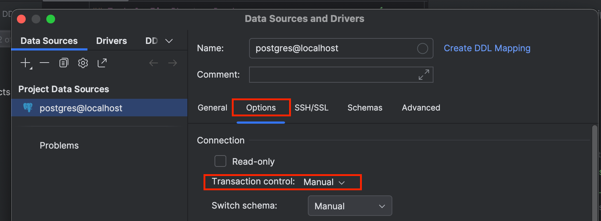

# PostgreSQL Transaction Isolation Lab

## Task 1: Fix Non-Repeatable Read

1. Run 01_create_tables.sql.
2. Open two query consoles.
3. Run 02_non_repeatable_read.sql in Session A.
4. Run 03_non_repeatable_read_update.sql in Session B.
5. In Session A execute:

SELECT available_count
FROM tickets
WHERE event_id = 1;

The value changes during the same transaction.

Goal:
Modify Session A so both reads return the same value.

---

## Task 2: Fix Phantom Read

1. Run 04_phantom_read.sql in Session A.
2. Run 05_phantom_read_insert.sql in Session B.
3. In Session A execute:

SELECT COUNT(*)
FROM reservations
WHERE event_id = 1;

The row count changes during the same transaction.

Goal:
Modify Session A so the second query returns the same count.

Restrictions:
- Do not change table structures.
- Solve using transaction isolation levels.
- Briefly explain your solution.

## Tips
Set up Manual commit for data source.
