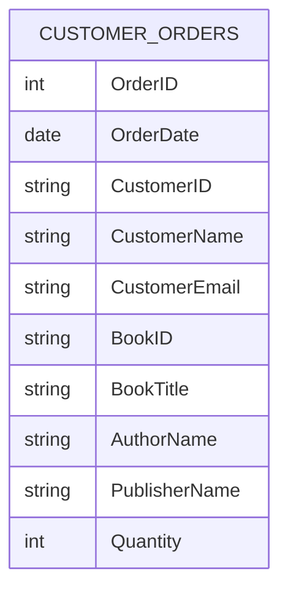
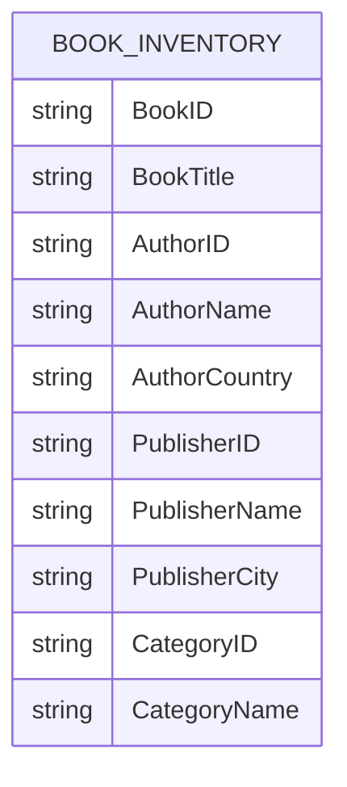
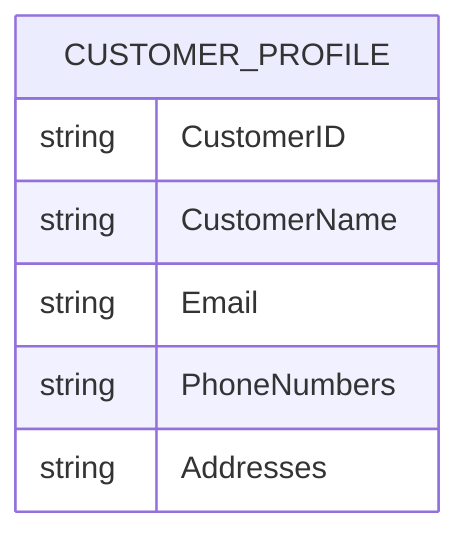

# Practice Assignment: Database Normalization for a Bookstore Application

### **1 point**

## Objective

You have joined a team developing an OLTP database for an online bookstore.

The current database design contains significant data redundancy and update anomalies. Your task is to analyze the provided tables and normalize them step-by-step until you reach an appropriate normal form for an OLTP system.

You should:

1. Identify normalization issues.
2. Determine functional dependencies.
3. Normalize the schema.
4. Define primary keys and foreign keys.
5. Create the final ERD.

---

# Dataset 1: Customer Orders

The development team stores order information in a single table.

## Table: CUSTOMER_ORDERS

| OrderID | OrderDate  | CustomerID | CustomerName | CustomerEmail                             | BookID | BookTitle        | AuthorName  | PublisherName | Quantity |
| ------- | ---------- | ---------- | ------------ | ----------------------------------------- | ------ | ---------------- | ----------- | ------------- | -------- |
| 1001    | 2025-01-10 | C001       | Alice Brown  | [alice@email.com](mailto:alice@email.com) | B101   | SQL Fundamentals | John Smith  | TechBooks Ltd | 2        |
| 1001    | 2025-01-10 | C001       | Alice Brown  | [alice@email.com](mailto:alice@email.com) | B102   | PostgreSQL Guide | Mary Wilson | TechBooks Ltd | 1        |
| 1002    | 2025-01-12 | C002       | Bob Taylor   | [bob@email.com](mailto:bob@email.com)     | B101   | SQL Fundamentals | John Smith  | TechBooks Ltd | 1        |
| 1003    | 2025-01-15 | C003       | Carol White  | [carol@email.com](mailto:carol@email.com) | B103   | Data Modeling    | David Clark | Data Press    | 3        |

---

## Mermaid Diagram

---

# Dataset 2: Book Inventory

The inventory team tracks books using the following structure.

## Table: BOOK_INVENTORY

| BookID | BookTitle        | AuthorID | AuthorName  | AuthorCountry | PublisherID | PublisherName | PublisherCity | CategoryID | CategoryName      |
| ------ | ---------------- | -------- | ----------- | ------------- | ----------- | ------------- | ------------- | ---------- | ----------------- |
| B101   | SQL Fundamentals | A001     | John Smith  | USA           | P001        | TechBooks Ltd | New York      | C001       | Databases         |
| B102   | PostgreSQL Guide | A002     | Mary Wilson | UK            | P001        | TechBooks Ltd | New York      | C001       | Databases         |
| B103   | Data Modeling    | A003     | David Clark | Canada        | P002        | Data Press    | Toronto       | C002       | Data Architecture |

---

## Mermaid Diagram

---

# Dataset 3: Customer Addresses

The application allows customers to have multiple addresses.

## Table: CUSTOMER_PROFILE

| CustomerID | CustomerName | Email                                     | PhoneNumbers       | Addresses                          |
| ---------- | ------------ | ----------------------------------------- | ------------------ | ---------------------------------- |
| C001       | Alice Brown  | [alice@email.com](mailto:alice@email.com) | 111-1111, 222-2222 | Home: NY; Office: Boston           |
| C002       | Bob Taylor   | [bob@email.com](mailto:bob@email.com)     | 333-3333           | Home: Chicago                      |
| C003       | Carol White  | [carol@email.com](mailto:carol@email.com) | 444-4444, 555-5555 | Home: Seattle; Warehouse: Portland |

---

## Mermaid Diagram

---

# Tasks

## Task 1

Analyze all three datasets and identify:

* Repeating groups
* Partial dependencies
* Transitive dependencies
* Update anomalies
* Insert anomalies
* Delete anomalies

---

## Task 2

Normalize the tables step-by-step.

Show the schema after:

* First Normal Form (1NF)
* Second Normal Form (2NF)
* Third Normal Form (3NF)

If you believe additional normalization is required, continue further.

---

## Task 3

Create the final normalized database design.

For each table specify:

* Table name
* Primary Key
* Foreign Keys
* Important attributes

---

## Task 4

Draw the final ERD.

---

# Bonus Challenge

Some books may have multiple authors.

Update your final design to support:

* One book → many authors
* One author → many books

Without introducing data redundancy.
