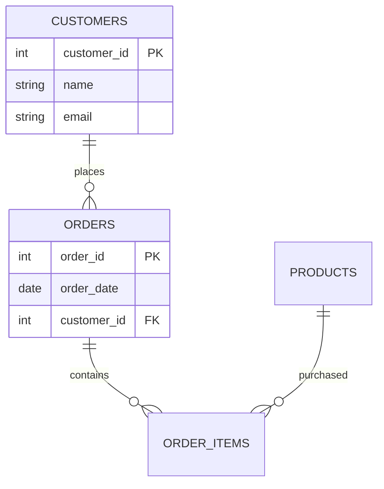

# Task. Design Your Own OLTP Database

## **1 point**

## Objective

Design an OLTP database for a business of your choice.

Examples:

* Online Store
* Food Delivery Service
* Hospital Management System
* Library Management System
* Hotel Booking System
* Fitness Club
* Airline Reservation System
* Car Rental Service
* University Management System
* Movie Ticket Booking System

You may choose another business domain if approved by the instructor.

---

## Requirements

Your database must:

### Functional Requirements

1. Support at least **5 business entities**.
2. Contain at least **8 tables** after normalization.
3. Support daily transactional operations.
4. Be normalized to at least **Third Normal Form (3NF)**.
5. Include:

    * Primary Keys
    * Foreign Keys
    * One-to-Many relationships
    * Many-to-Many relationship(s) resolved through bridge tables
6. Avoid data redundancy and update anomalies.

---

## Deliverables

### Part 1. Business Description

Provide a short description of:

* Business domain
* Main users
* Business processes supported by the system

---

### Part 2. Business Questions

Your database must be able to answer the following types of questions.

#### Customers / Users

* Who are the customers/users of the system?
* How many active customers are there?
* What information is stored about customers?

#### Transactions

* What transactions occur in the system?
* When did a transaction happen?
* Who performed the transaction?

#### Products / Services

* What products or services are offered?
* What categories do they belong to?
* What is their current status?

#### Operational Reporting

Your database should support answering questions such as:

* What are the most popular products/services?
* Which customers generate the highest revenue?
* What transactions occurred during a specific period?
* What entities currently have active status?
* What are the current inventory/resource levels (if applicable)?

---

### Part 3. Data Model

Create:

* Conceptual Model
* Logical Model
* Physical Model

For each table specify:

* Table Name
* Primary Key
* Foreign Keys
* Attributes

---

### Part 4. ER Diagram

Create a Mermaid ER diagram.

Example:



---

### Part 5. SQL Implementation

Provide PostgreSQL DDL scripts for:

* CREATE TABLE statements
* Primary Keys
* Foreign Keys
* Unique Constraints
* Check Constraints (where appropriate)

---

### Part 6. Sample Data

Insert at least:

* 10 records into the main transactional table
* 10 records into reference tables
* Enough data to demonstrate relationships

---

### Part 7. Validation

Demonstrate how your database can answer at least **10 business questions** using SQL queries.

Examples:

```sql
-- Top 5 customers by revenue

-- Orders created this month

-- Most popular product

-- Number of active users

-- Revenue by category

-- Products never ordered

-- Customers without transactions

-- Average order value

-- Monthly sales trend

-- Top selling category
```

---

