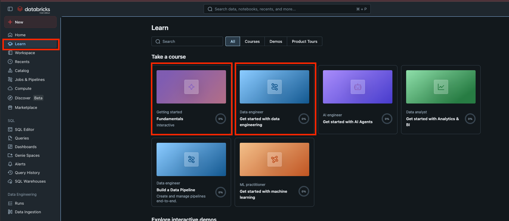

# Getting Started with Databricks

## 2 Points

## Goal

Create a free Databricks account and complete the introductory learning courses to become familiar with the platform.

## Tasks

1. Register for a [**free Databricks account**](https://docs.databricks.com/aws/en/getting-started/free-edition).
2. Log in to your Databricks workspace.
3. Open the **Learning** section.
4. Complete the following courses:

   * **Fundamentals**
   * **Get Started with Data Engineering**

5. Take screenshots confirming that both courses have been completed.

## Submission

Submit a PDF containing:

* A screenshot of your Databricks workspace.
* A screenshot showing the completion of the **Fundamentals** course.
* A screenshot showing the completion of the **Get Started with Data Engineering** course.

> **Note:** No additional coding or practical tasks are required for this assignment. The goal is simply to become familiar with the Databricks platform and its learning materials.
